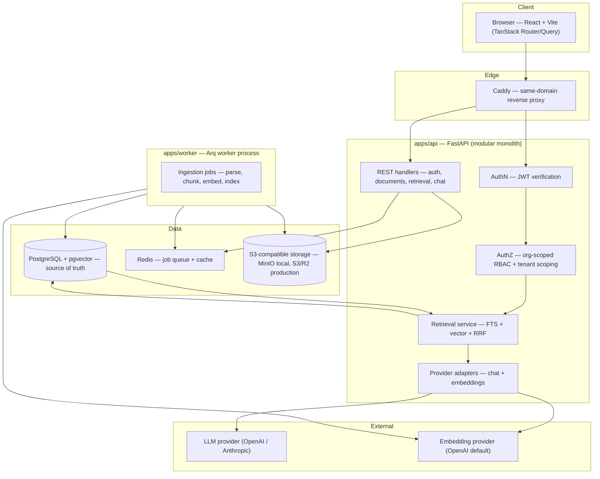
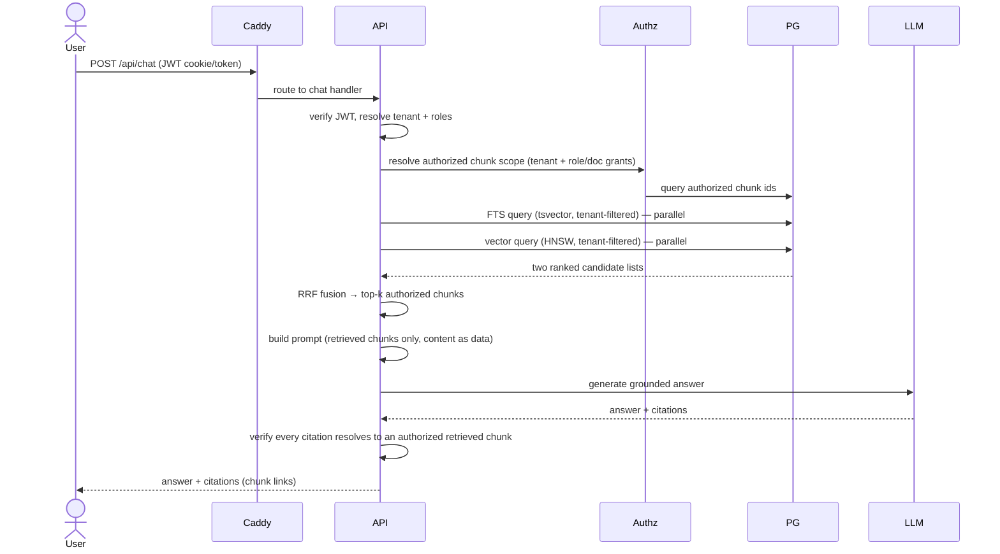
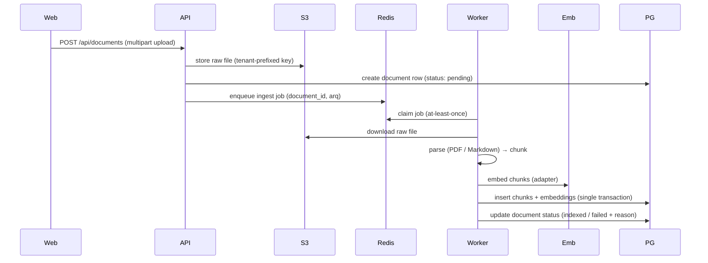
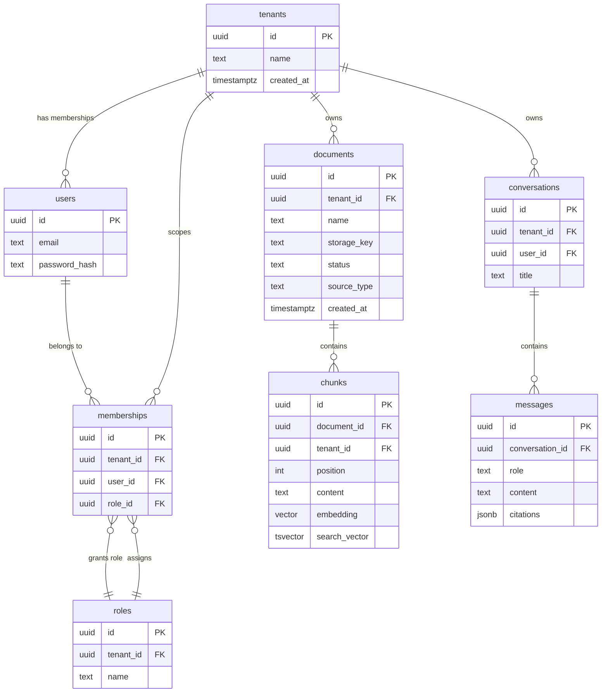

# ARCHITECTURE.md

> **Status**: Draft — target design; setup phase: local infrastructure configured, application services planned &nbsp;|&nbsp; **Last updated**: 2026-08-04 &nbsp;|&nbsp; **Author**: Jonathan Soto (jonasotoaguilar)

This document is the target architecture for raguard as specified by [PRD.md](./PRD.md). At the setup phase the local infrastructure (PostgreSQL + pgvector, Redis, MinIO, Caddy) exists in `infra/compose.yaml`; the application services (API, worker, web) and the behaviors they implement remain planned. Where the PRD leaves a product decision open, this document says so explicitly (see [Open Decisions](#open-decisions)) instead of inventing settled behavior.

## System Overview **[ALWAYS]**

raguard is a self-hosted, multi-tenant conversational RAG system over internal documents (PDF and Markdown in the MVP). Organizations upload documents; the system chunked, embeds, and indexes them; employees ask questions in natural language and receive answers grounded in retrieval, filtered by their permissions, with verifiable citations to the exact chunks they may access. A precision evaluation harness measures retrieval and citation quality offline and gates changes. The system runs on standard, replaceable infrastructure (PostgreSQL + pgvector, Redis, S3-compatible storage, Docker Compose) behind a single Caddy entry point — no proprietary RAG platform lock-in.

## Architecture Pattern **[ALWAYS]**

**Chosen pattern**: Modular monolith (API) + dedicated async worker process. The repo is a monorepo (`apps/web`, `apps/api`, `apps/worker`, `infra`).

**Why this pattern**: The MVP has one dominant query path (chat retrieval) and one batch path (ingestion) with a single shared data store; a modular monolith keeps transactions, data integrity, and tenant authorization inside one codebase, while the separate worker process isolates CPU/IO-bound ingestion (parsing, embedding API calls) from request latency. No independent scaling of internal services is needed yet — only the API and worker scale horizontally, and their coupling surface is the database plus the job queue.

**Alternatives evaluated**:
- **Microservices (event-driven, Kafka)**: Operational complexity disproportionate to a 2-path MVP; distributed transactions and cross-service authz checks would multiply the places the authorization invariant could break. See [ADR-0001](docs/adr/0001-modular-monolith-with-worker.md).
- **Full monolith (single process, in-process background tasks)**: Simpler initially, but embedding/ingestion load would compete with request latency and there is no isolation for retries, backpressure, or independent scaling of ingestion work.

## Architecture Views & Diagrams **[ALWAYS]**

### System Architecture Diagram

### Runtime Flow — Chat & Retrieval

The authorization invariant requires the **two retrieval queries and the RRF fusion to be tenant- and role-filtered before the prompt is built** — un-authorized chunks never reach the model, and citations are verified against the authorized result set after generation ([ADR-0002](docs/adr/0002-retrieval-level-authorization.md)).

### Runtime Flow — Document Ingestion

### Data Model **[CONDITIONAL — data model in scope]**

> The ERD is the **planned** model. `chunks` carries both the embedding vector and the FTS `tsvector` so both retrieval signals stay physically colocated; `messages.citations` records which chunk ids a message cites (the provenance ledger for citation verifiability). Chat-persistence details (`conversations`/`messages` shape, retention) depend on the open product decision on chat history.

## Component Details **[ALWAYS]**

### Web App (`apps/web`)

- **Technology**: React + Vite, TanStack Router + TanStack Query (TypeScript)
- **Responsibility**: Chat interface, document management, admin views (users/roles), citation navigation
- **Scaling**: Static assets served by Caddy; no server-side state
- **Dependencies**: API over same-domain `/api`
- **Failure modes**: API down → empty/error states via TanStack Query; no auth bypass — UI hiding is never an authorization control

### API (`apps/api`)

- **Technology**: Python 3.13, FastAPI, SQLAlchemy 2 (async) + psycopg3, Pydantic
- **Responsibility**: JWT auth, org-scoped RBAC, document upload, retrieval + RRF fusion, chat orchestration, citation verification, ingestion job enqueueing
- **Scaling**: Horizontal (stateless; JWT-verified identity per request, no sticky sessions)
- **Dependencies**: PostgreSQL (source of truth), Redis (queue producer, cache), object storage, provider adapters
- **Failure modes**: LLM provider down → bounded retries then explicit error, no fallback to ungrounded generation; Redis down → upload/chat-enqueue degraded, retrieval still serves

### Worker (`apps/worker`)

- **Technology**: Python 3.13, Arq worker over Redis
- **Responsibility**: Ingestion pipeline — download raw file, parse PDF/Markdown, chunk, embed, index chunks, update document status
- **Scaling**: Independent horizontal scaling; job lease via Arq (see [ADR-0004](docs/adr/0004-redis-arq-async-jobs.md))
- **Dependencies**: Redis (queue), object storage, embedding adapter, PostgreSQL
- **Failure modes**: Embedding provider outage → retry with backoff, document stays `pending`/`failed` with visible status; crash mid-job → at-least-once redelivery, idempotent re-indexing

### PostgreSQL + pgvector

- **Technology**: Pinned `pgvector/pgvector` image, pgvector 0.8.x (HNSW/cosine), pg_trgm where needed
- **Responsibility**: Source of truth for tenants, users, roles, documents, chunks, conversations; FTS (`tsvector` + GIN) and vector (HNSW) indexes; hybrid retrieval inputs
- **Scaling**: Vertical initially; read replicas later if load grows (deferred)
- **Dependencies**: None (owned by the platform)
- **Failure modes**: Primary failure → service unavailable; recovery via backups; no cross-tenant data path can proceed without the DB

### Redis

- **Technology**: Redis server pinned `redis:8.10.0-alpine` at setup; Arq 0.28.0 with redis-py 5.3.1 — Arq's supported dependency range excludes redis-py 6, so redis-py 6.x is not resolvable with Arq; job queue + cache
- **Responsibility**: Durable-enough job queue with lease semantics; small cache for static config/embedding metadata
- **Scaling**: Single instance for MVP; persistence configurable per durability needs
- **Failure modes**: Queue loss → ingestion stalls with visible status; in-flight jobs may retry; cache loss → only performance impact

### Object Storage (S3-compatible)

- **Technology**: `boto3` with `endpoint_url`; MinIO locally, S3/R2 in production ([ADR-0006](docs/adr/0006-s3-compatible-object-storage.md))
- **Responsibility**: Raw document binaries (tenant-prefixed keys); chunk text lives in PostgreSQL
- **Failure modes**: Upload failure → document rejected atomically (no orphan DB row); storage outage → new ingestion paused, existing retrieval unaffected

### Provider Adapters

- **Technology**: Provider-neutral chat adapter (OpenAI/Anthropic) and replaceable embedding adapter (OpenAI default) ([ADR-0005](docs/adr/0005-provider-neutral-model-adapters.md))
- **Responsibility**: Isolate external model APIs behind one internal interface; system prompt never merged with untrusted document content
- **Failure modes**: Rate limits/outages → bounded retries + backoff in API/worker; credentials via env/secret manager, never in code or manifests

### Caddy

- **Technology**: Caddy reverse proxy
- **Responsibility**: Same-domain routing: web app at `/`, API at `/api`; TLS termination; no per-service routing decisions in the client
- **Failure modes**: Proxy down → whole product unreachable (single entry point by design for the MVP)

## Data Architecture **[CONDITIONAL — data model and storage strategy in scope]**

### Database Selection

| Database | Type | Purpose | Rationale |
|----------|------|---------|-----------|
| PostgreSQL + pgvector | Relational + vector | Source of truth: tenants, users, roles, documents, chunks (+ embeddings), conversations; FTS + vector retrieval | One store for transactional data *and* both retrieval signals keeps authz joins and tenant filtering in plain SQL; avoids a separate search engine's sync and authz-coupling overhead |
| Redis | KV / queue | Arq job queue; small cache | Already required for async jobs; no separate broker needed for the MVP |
| S3-compatible object storage | Object store | Raw document binaries | Cheap, standard, replaceable (MinIO local, S3/R2 production) |

### Data Model Overview

See the [ERD](#data-model) above. Key ownership rules: every row that must be tenant-scoped carries `tenant_id`; membership (`memberships`) is the join between a user, a tenant, and a role; document visibility is role/tenant-based and resolved into an **authorized chunk id set at query time** (see [Tenant Isolation & Authorization](#tenant-isolation--authorization-defense-in-depth)).

### Indexing & Access Paths

- Hot query paths: (1) retrieval — FTS rank per tenant and vector cosine per tenant, in parallel; (2) authz resolution — memberships/roles → authorized documents → chunk ids; (3) chat history read/write.
- Index strategy: GIN on `chunks.search_vector` (FTS); HNSW on `chunks.embedding` using cosine distance (`halfvec_cosine_ops`); composite `(tenant_id, …)` leading indexes on every tenant-scoped table so tenant filtering uses the index; FK indexes per the schema rules.
- Vector + FTS are fused at the **application/query layer** with RRF (`k = 60`, candidates ~50 per signal, configurable) because pgvector has no native RRF; the two queries run in parallel and fuse client-side ([ADR-0003](docs/adr/0003-postgres-fusion-hybrid-retrieval.md)).
- Filtering strategy: with tenant/role filters expected to be selective, prefer index-assisted prefiltering of both signals (filtered HNSW + `tsvector` + tenant predicate); tune via `hnsw.ef_search` against the evaluation set.
- Write-cost tradeoff: HNSW/GIN writes are acceptable at MVP volume; chunk insert batches happen inside one transaction per document in the worker.

### Caching Strategy

| What is cached | Where | TTL | Invalidation |
|---------------|-------|-----|-------------|
| Embedding metadata / model config | Redis | Long (config-driven) | Manual / deploy |
| Authorized chunk scopes | Not cached by default | — | Authz is resolved fresh per request in the MVP; caching it risks stale permissions and violates the invariant if done wrong. Revisit only with explicit revocation timing. |
| Retrieved chunks / answers | Not cached | — | Answers are grounded in live authz; caching retrieved content introduces a second place permissions must hold |

### Connection Budget

- MVP local: one API instance + one worker instance, each with a modest async pool (e.g., 5–10); single PostgreSQL container with default limits — ample headroom.
- Production: compute pool_per_instance × instances vs. server limit; keep ≥ 20% headroom; connection limits are configured at deploy time, not documented here as a fixed number.

### Consistency & Concurrency

- Transaction boundaries: document row + chunks + embeddings committed together in the worker; chat message + citations committed per message; upload: storage write then DB row — orphan row on storage failure is cleaned by retry/status transition.
- Conflict handling: ingestion is idempotent by document id (re-run replaces that document's chunks); optimistic concurrency not needed for MVP single-writer flows.
- Consistency model: strong within PostgreSQL (single source of truth); object storage treated as write-once binary blob with DB as the index.
- Async correctness: job idempotency keys (document_id) and at-least-once delivery ([ADR-0004](docs/adr/0004-redis-arq-async-jobs.md)).

## Tenant Isolation & Authorization (Defense-in-Depth)

This is the product's non-negotiable invariant from the PRD, restated as architecture:

1. **Retrieval-level filtering (primary control)**: tenant and role/document permissions are applied in the retrieval queries *before* any generation. Un-authorized chunks cannot be retrieved, cited, or entered into the prompt ([ADR-0002](docs/adr/0002-retrieval-level-authorization.md)).
2. **Citation verification (secondary control)**: after generation, every citation must resolve to a chunk id in the authorized retrieval result; citations to anything else are rejected before persisting/rendering.
3. **API-scope enforcement (tertiary)**: all data routes resolve the request tenant from the verified JWT — never from a client-supplied value; UI-level hiding is explicitly not an authorization control.
4. **Candidate (defense-in-depth, not yet decided)**: PostgreSQL Row-Level Security keyed to the resolved tenant context could add a DB-enforced backstop, but it requires careful connection/tenant-context handling (session-level `app.tenant_id` with pooled connections) and is an open decision; it must never replace the retrieval-layer filtering.
5. **Document content is untrusted data**: prompt-injection hardening keeps system/user instructions separate from retrieved content; adversarial documents are part of the security test suite.

## API Architecture **[CONDITIONAL — the system has an API surface]**

### API Contract

- **Style**: REST under `/api` (same-domain via Caddy); JSON bodies; OpenAPI generated by FastAPI
- **Consumers**: Web app only (MVP); no external partners
- **Versioning**: URL-prefix versioning (`/api/v1/…`) reserved for when needed; not deployed preemptively

### API Quality Checklist

- Stateless across instances: **Yes** — JWT carries identity; no sticky sessions
- Versioning strategy: URL prefix `/api/v1` (reserved)
- Authentication: thin custom JWT (signed, expiring) issued at login; cookie or Bearer via proxy conventions set at config time
- Authorization model: org-scoped RBAC — tenant + role resolved from the JWT per request; role checks enforced server-side
- Error envelope: consistent `{error: {code, message, details?}}` shape (define precisely at API build)
- Pagination/filtering/sorting: cursor or offset pagination for document lists; decided at API build
- Idempotency: document upload enqueues one job per document id (idempotent by design); chat is non-mutating
- Rate limiting: per-user/per-tenant limits on chat and upload endpoints, enforced at API (Caddy could front them later)
- API Gateway: **Not used** — Caddy is a plain reverse proxy; routing/authz/rate limits live in the API for the MVP

### Realtime Transport *(only when clients receive live updates)*

- **Polling** (MVP): the web app polls document status and job progress; no server-push in the MVP
- Latency target: status refresh within seconds is acceptable; retrieval answers come from the request/response path (p95 < 10 s draft target)

## Async Delivery **[CONDITIONAL — jobs are part of the design]**

- Delivery semantics: **at-least-once** via Arq lease; consumer deduplicates by job content (document id) and idempotent re-indexing ([ADR-0004](docs/adr/0004-redis-arq-async-jobs.md))
- Ordering: per-document ordering only (a re-ingest supersedes previous chunks for that document)
- Backpressure: bounded retries with exponential backoff; per-document jobs avoid unbounded queue growth; backlog is observable via queue depth + document status
- Retry budget & failure handling: max-retries config with final failure state (`failed` + reason) surfaced in the UI; no DLQ in the MVP — failed documents are re-enqueued manually or by re-upload
- Event envelope: jobs carry ids/references (document_id), not payloads; the worker reads current state from PostgreSQL/object storage

## Non-Functional Requirements **[CONDITIONAL — targets with measurable values]**

Targets marked *draft* come from the PRD and are confirmed once the evaluation harness and load environment exist.

### Performance
- Time to first answer: p95 < 10 s on the reference dataset *(draft, confirm with load testing)*
- Retrieval query (both signals, parallel): p95 < 500 ms for MVP corpus sizes *(draft)*

### Scalability
- MVP concurrent users: tens to low hundreds per tenant *(draft)*; horizontal scaling of API and worker is the designed lever
- Data volume: documents in the thousands to tens of thousands of chunks per tenant *(draft)*

### Availability
- Target: 99% *(draft)* for a self-hosted internal tool
- RPO: ≤ 1 hour (PostgreSQL backups + storage redundancy), RTO: ≤ 1 day *(draft)*
- Validation: restore drill from backups before production rollout

### Security
- Authentication: thin custom JWT; secrets in env/secret manager only
- Authorization: retrieval-level filtering (invariant) + citation verification; adversarial document tests and cross-tenant/cross-role leak tests in the suite
- Encryption: in transit (TLS via Caddy), at rest (PostgreSQL/storage provider defaults)
- Compliance: none in the MVP (self-hosted; see PRD non-goals)

### Observability
- Logging: structured logs (JSON) from API and worker
- Metrics: request latency/error rates, retrieval latencies, queue depth, job success/failure counts
- Tracing: correlation ids per request and per job (breadcrumb-level; full distributed tracing deferred)
- Alerts: failure-rate and queue-backlog alerts before production rollout

### Maintainability
- Deployment: Docker Compose — local infrastructure runs from `infra/compose.yaml`; application services (API/worker/web) are added to the same topology at implementation; self-hosted production deployment uses the same Compose approach
- CI/CD: to be defined at config phase (lefthook/pytest/vitest/playwright are planned)
- IaC: none in the MVP beyond Compose files; production manifests are out of scope

### Cost
- Budget: self-hosted, standard components; no proprietary RAG platform costs. Exact budget set at config/deploy time.

## Deployment & Configuration Principles

- **Local topology (setup evidence)**: `infra/compose.yaml` currently provides local infrastructure only — `pgvector/pgvector:0.8.6-pg17` (PostgreSQL `shm_size` 1 GB for pgvector HNSW index builds), `redis:8.10.0-alpine`, `minio/minio:RELEASE.2025-09-07T16-13-09Z` — plus a Caddy proxy gated behind the `proxy` profile. MinIO is local development only: the upstream project is unmaintained (its repository points to AIStor) and the image is pinned to the last verifiable published image; revalidate before any non-local use — S3/R2 are the production targets. The API, worker, and web services remain planned; once implemented, Caddy routes `/` → web and `/api` → API.
- **Production topology**: same services, with S3 (or R2) instead of MinIO and provider keys from a secret manager; Caddy terminates TLS. No architectural difference — storage and providers are adapter-abstracted ([ADR-0006](docs/adr/0006-s3-compatible-object-storage.md), [ADR-0005](docs/adr/0005-provider-neutral-model-adapters.md)).
- **Configuration**: environment-based (`.env.example` present at setup; never commit real credentials); versions verified at setup time — lockfiles and pinned images are authoritative.
- **Secrets**: provider credentials and JWT signing keys in env/secret manager; `.env` gitignored.

## Key Decisions **[ALWAYS]**

| Decision | Rationale | Alternatives Considered |
|----------|-----------|------------------------|
| Modular monolith API + separate worker process ([ADR-0001](docs/adr/0001-modular-monolith-with-worker.md)) | One shared store, two load paths; smallest surface for the authorization invariant; worker isolates ingestion | Microservices/Kafka; single-process monolith |
| Retrieval-level authorization, never UI-only ([ADR-0002](docs/adr/0002-retrieval-level-authorization.md)) | PRD invariant: un-authorized chunks must not reach generation; citations verified against the authorized set | Post-filtering after retrieval; RLS-only enforcement |
| PostgreSQL FTS + pgvector fused with RRF at the application layer ([ADR-0003](docs/adr/0003-postgres-fusion-hybrid-retrieval.md)) | Hybrid recall without a separate search engine; pgvector has no native RRF; tenant filtering stays in SQL | Dedicated search engine (e.g., OpenSearch/Meilisearch); pg_textsearch BM25 extension (prerelease, rejected for now) |
| Redis + Arq for async jobs ([ADR-0004](docs/adr/0004-redis-arq-async-jobs.md)) | Simple at-least-once queue with lease semantics; Redis already in the stack | Celery/RQ; Kafka/event bus |
| Provider-neutral chat + embedding adapters ([ADR-0005](docs/adr/0005-provider-neutral-model-adapters.md)) | No vendor lock-in; OpenAI embeddings default (Anthropic has no embeddings); replaceable | Direct SDK calls |
| S3-compatible object storage via `boto3` `endpoint_url` ([ADR-0006](docs/adr/0006-s3-compatible-object-storage.md)) | One abstraction for MinIO (local) and S3/R2 (production) | Local filesystem; proprietary blob storage |
| React + Vite + TanStack Router/Query web app | Fast, typed client with robust data fetching; same-domain proxy keeps auth simple | Next.js/SSR; other bundlers |
| Caddy same-domain routing | Single origin simplifies cookies/JWT, TLS, and CORS | Multi-origin API subdomain; dedicated gateway |
| Python 3.13 + FastAPI + SQLAlchemy 2 (async) + psycopg3 | Mature async stack; psycopg3 supports pgvector registration for async sessions | Django/DRF; sync SQLAlchemy |
| Chunking params + RRF weights parameterized | PRD: tuning happens against the evaluation set, not by decree | Hard-coded defaults |

## Open Decisions

| # | Open decision | Current working assumption | Blocked by / owner |
|---|---|---|---|
| 1 | Chat history persistence + retention | Persist conversations/messages per tenant; retention policy pending | PRD open decision; config/product owner |
| 2 | Document deletion semantics | Deletion removes document row + chunks + embeddings immediately (assumed); not yet decided | PRD open decision |
| 3 | Chunking strategy + RRF weights | Parameterized defaults; tuned against evaluation set | Evaluation harness |
| 4 | Tenant provisioning | Admin-invited only in the MVP (PRD default); self-serve later | PRD open decision |
| 5 | Evaluation harness in-repo vs separate tool | Not yet decided; determined at the config phase | PRD open decision |
| 6 | PostgreSQL RLS as defense-in-depth | Not adopted yet; would require session tenant-context handling with pooled connections | Security review; never replaces retrieval-layer authz |
| 7 | Rate limits per user/tenant | Enforce at API; exact limits at config phase | Config phase |

## Failure Modes & Mitigations **[CONDITIONAL — realistic failure modes]**

| Failure | Impact | Mitigation |
|---------|--------|------------|
| LLM provider outage | Chat unavailable; no answers | Bounded retries + backoff; explicit error; never generate without retrieval (grounding invariant) |
| Embedding provider outage | Ingestion stalls | Worker retries with backoff; document stays `pending`/`failed` with visible status; no partial index |
| Redis outage | No new jobs; ingestion stops | Upload/chat degraded path defined; retrieval (stateless) unaffected; persistence config per durability needs |
| PostgreSQL outage | Entire product down (single source of truth) | Backups (RPO ≤ 1 h, RTO ≤ 1 d, *draft*); restore drill validated before production; no cross-tenant fallback path exists by design |
| Object storage outage | Uploads fail; new ingestion paused | Upload rejected atomically (no orphan rows); existing retrieval unaffected; storage redundancy per provider |
| Poison job (bad PDF) | Document ingestion repeatedly fails | Bounded retries → `failed` status + reason surfaced; manual re-enqueue; no DLQ in the MVP |
| Rate limiting by provider | Slow ingestion/chat | Backoff and retry budgets; queue depth monitored |
| Authorization regression | Cross-tenant/role leakage (the worst case) | Retrieval-level filtering invariant + citation verification; automated leak tests across tenants/roles are a release gate (PRD KPI 2) |

> Failure validation: recovery claims above (backups, retries) are validated by the security/authorization test suite and restore drills scheduled at config phase — unvalidated mitigations are intentions, not mitigations.

## ADRs **[ALWAYS]**

- [ADR-0001: Modular monolith API with dedicated worker process](docs/adr/0001-modular-monolith-with-worker.md)
- [ADR-0002: Retrieval-level authorization and tenant isolation](docs/adr/0002-retrieval-level-authorization.md)
- [ADR-0003: PostgreSQL FTS + pgvector hybrid retrieval fused with RRF](docs/adr/0003-postgres-fusion-hybrid-retrieval.md)
- [ADR-0004: Redis + Arq for asynchronous job processing](docs/adr/0004-redis-arq-async-jobs.md)
- [ADR-0005: Provider-neutral chat and embedding adapters](docs/adr/0005-provider-neutral-model-adapters.md)
- [ADR-0006: S3-compatible object storage abstraction](docs/adr/0006-s3-compatible-object-storage.md)

## Appendix

- [PRD.md](./PRD.md) — product intent, scope, invariants, success criteria (source of truth for product behavior)
- Local reference skills (implementation-phase, not architecture): `.agents/skills/` — pgvector-semantic-search, postgres-hybrid-text-search, llm-security, fastapi, redis-core
