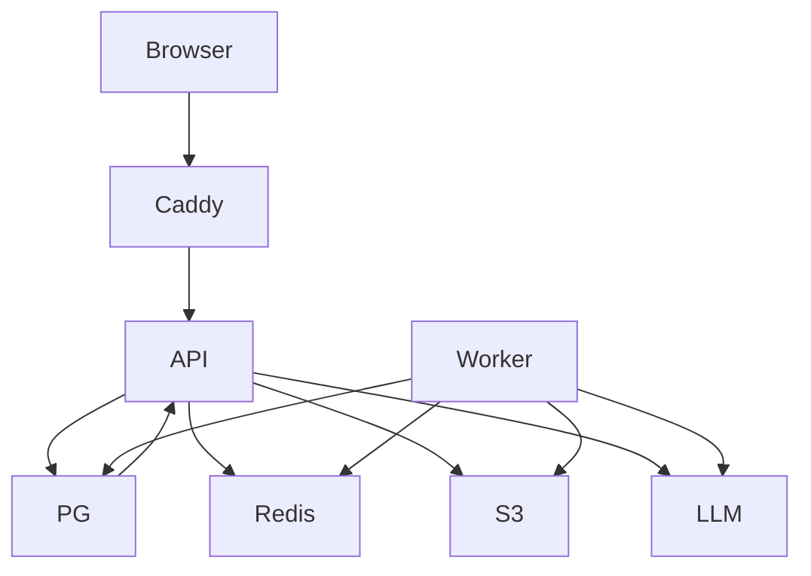

# Mental model

Detailed mental model for raguard's monorepo. Keep [CODEBASE-GUIDE](../CODEBASE-GUIDE.md) as the navigational index — this page is the one deep read that explains *why* the repo is shaped this way.

## What this project is

raguard is a self-hosted, multi-tenant conversational RAG over internal PDF and Markdown documents. Organizations upload documents; the system chunks, embeds, and indexes them in PostgreSQL + pgvector; employees ask questions in natural language and receive answers grounded in retrieval, filtered by their permissions, with `[n]`-verified citations to the exact chunks they may access. The offline precision evaluation harness that gates retrieval/citation quality is the next slice and is not yet delivered.

## What this project is not

- Not a public search engine — every query is scoped to exactly one tenant (never cross-tenant) and to the caller's role-granted documents.
- Not a generic chatbot — answers are grounded in retrieved chunks via a static prompt; document content is untrusted data delimited as `UNTRUSTED_SOURCES_START/END`, never merged into instructions.
- Not microservices — a modular FastAPI monolith (`apps/api`) plus a dedicated Arq worker (`apps/worker`) share PostgreSQL + Redis + S3-compatible storage; the only inter-process coupling is those three.
- Not a web-complete product yet — `apps/web` is scaffold/tooling only; the API (`POST /api/search`, `POST /api/chat`) is live, the UI is still planned.
- Not self-serve tenant provisioning — first tenant is created once via `apps/api/raguard-bootstrap` under `pg_advisory_xact_lock`; further tenant lifecycle is an open decision.

## 90-second architecture model

Think of three layers behind one entry point. **Edge**: Caddy (`infra/Caddyfile`, proxy profile in `infra/compose.yaml`) routes `/api` → API. **Application**: `apps/api` (`main.py` wires `auth`, `org`, `documents`, `retrieval`, `chat`) handles identity/JWT, org/RBAC, document enqueue, hybrid retrieval, and bounded chat; `apps/worker` (`raguard_worker/settings.py` → `jobs.py`) consumes the Redis queue. **Data**: PostgreSQL + pgvector (source of truth, FTS GIN + HNSW `halfvec(1536)` cosine, `shim_size` 1 GB for index builds), Redis (queue + small cache), S3-compatible object store (MinIO local, S3/R2 production via `boto3` `endpoint_url`).

## Core invariants (non-negotiable — from PRD and ARCHITECTURE.md)

- **Retrieval-level authorization (primary)**: Tenant and role/document permissions are applied *in the retrieval queries before any generation* (`retrieval/service.py:retrieve_chunks` + `retrieval/queries.py` via `AuthorizationScope.tenant_predicate`). Un-authorized chunks cannot be retrieved, cited, or entered into the prompt. UI hiding is never an authorization control ([ADR-0002]( ../adr/0002-retrieval-level-authorization.md)).
- **Citation verification (secondary)**: After generation, every `[n]` marker is verified against the exact ordered retrieved set that built the prompt (`chat/citations.py:verify_citations`); any index outside `1..len(chunks)` rejects the whole response via the 503 envelope — no partial answer, no rendering of unverified content.
- **Fresh-per-request resolution (tertiary)**: All protected routes obtain authorization through the single `AuthorizationResolver.resolve` → `AuthorizationScope` dependency (`authorization/resolver.py`), fresh per request, never cached — role changes apply on the next request without invalidation. JWT carries only `sub`/`tid` + standard claims, no roles.
- **Untrusted document content**: `chat/prompts.py` builds a static `SYSTEM_PROMPT` (free of secrets/tenant ids) plus user prompt with chunk JSON inside `UNTRUSTED_SOURCES_START/END` delimiters; the completer (`chat/providers/openai.py`) never sees instructions merged from documents. Adversarial document tests are part of the release gates.
- **No leakage on neutral paths**: Empty corpus and populated no-match both return the identical neutral result (`{answer: null, citations: []}` for chat, `{"results": []}` for search) with zero provider calls; neither signal discloses existence of another tenant's data, and errors never leak tenant/provider/internal details.

## Subsystem boundaries

- **API monolith** (`apps/api/src/raguard_api/`): Owns transactions, tenant isolation, and the two read paths (search, chat) plus write path (documents). Boundaries are module-level (`auth/`, `authorization/`, `identity/`, `documents/`, `retrieval/`, `chat/`, `org/`). Stateless — horizontal scaling via JWT.
- **Worker** (`apps/worker/src/raguard_worker/`): Owns CPU/IO-bound ingestion (download → `parsers.py` PDF/Markdown → `chunking.py` → `embeddings.py` via `OpenAIEmbedder` → atomic `jobs.py` chunk insert + `cleanup.py`). Independent scaling; at-least-once via Arq lease, idempotent by document id.
- **Web** (`apps/web/`): Owns presentation when built; today only Vite/Vitest/Playwright tooling. No server state, no auth bypass.
- **Infra** (`infra/`): Owns deployment topology, not application behavior.

## Primary flows (same as CODEBASE-GUIDE, with more context)

### Document ingestion — `POST /api/documents`

`Web → API (documents/router.py: validate size/type/extension/PDF signature) → S3 put (tenant-prefixed key via S3ObjectStore) → commit pending Document row → enqueue Arq job ingest:{document_id} (ArqJobQueue) → dispatch_ready commit → 202; cleanup compensates (object then row, bounded jitter) on failure so no orphan remains. Worker claims job → download → parse → chunk → embed (adapter) → PG single-transaction chunk+embedding insert → status indexed/failed + failure_reason. Pollable via GET /api/documents (corpus.view, tenant_predicate).`

### Hybrid retrieval — `POST /api/search`

`Client → API (retrieval/router.py: bounded query/top_k validation) → AuthorizationResolver (fresh scope, chat.use gate, 401/403 envelope) → retrieval/service.py:retrieve_chunks: embed once (OpenAIEmbedder or FakeEmbedder in tests) → parallel tenant-filtered signals: FTS simple plainto_tsquery + ts_rank (build_keyword_query) and vector halfvec(1536) cosine within RETRIEVAL_SEMANTIC_MAX_DISTANCE + hnsw.ef_search (build_semantic_query), both tenant-joined and chunk-id-tiebroken → rrf_fusion(k=60) deterministic (score desc, chunk_id asc) → top-k bound → {"results": […] } (chunk_id, document_id, document_name, position, content, ranks, score). Any embedding/query failure → 503 envelope, no partial results.`

### Bounded chat — `POST /api/chat`

`Client → API (chat/router.py: ChatRequest via create_chat_request(settings) bounded query/top_k) → fresh scope + chat.use gate → retrieve_chunks (same pipeline) → if empty: byte-identical neutral {answer: null, citations: []} with zero completer calls; else: chat/prompts.py:build_completion_prompt (static SYSTEM_PROMPT + numbered JSON sources inside UNTRUSTED delimiters, outside completer) → chat/providers/openai.py:OpenAICompleter.complete (disabled SDK retries, CHAT_RETRIES 0..2, PROVIDER_TIMEOUT_SECONDS, CHAT_MAX_OUTPUT_TOKENS) → chat/citations.py:verify_citations([n] markers, deduplicated by first occurrence, out-of-range rejects) → ChatResponse(answer, citations: [] | verified Citation[]). Provider or citation verification failure → warning log + 503 "Chat unavailable" envelope, no partial answer, no fallback to ungrounded generation. Same leakage/neutrality guarantees as search, plus retry-exhaustion gate.`

## Data model (live at 0002)

`tenants (id, name)` ← `users (id, email unique)` via `memberships (user_id, tenant_id, role_id)` ← `roles (tenant_id, name unique-per-tenant, capabilities TEXT[] CHECK allowlist)`; `documents (id, tenant_id FK, name, storage_key internal, status ∈ pending/indexed/failed CHECK, failure_reason CHECK allowlist, dispatch_ready internal, created_at, indexes tenant_id,status and tenant_id,created_at, unique tenant_id,id)` ← `chunks (id, tenant_id FK, document_id FK via composite tenant_id,document_id → documents, position unique-per-document, content, embedding halfvec(1536) HNSW halfvec_cosine_ops m16 ef64, search_vector TSVECTOR generated to_tsvector('simple',content) GIN, index tenant_id,document_id)`. Every tenant-scoped row carries `tenant_id`; FK `fk_chunks_tenant_document` prevents cross-tenant chunk attachment. `conversations`/`messages` remain planned (see ARCHITECTURE.md ERD note).

## Configuration & validation

`apps/api/src/raguard_api/config.py:Settings` (pydantic-settings, extra ignore) holds JWT (`JWT_SECRET` ≥32, `JWT_ISSUER/AUDIENCE/EXPIRY_MINUTES`, cookie `SESSION_COOKIE_*`, `ALLOWED_ORIGINS` JSON), object store (`OBJECT_STORE_*`), queue (`REDIS_URL`, job function), retrieval (`RRF_K`, `RETRIEVAL_CANDIDATES`, `RETRIEVAL_TOP_K*`, `RETRIEVAL_EF_SEARCH`, `RETRIEVAL_SEMANTIC_MAX_DISTANCE` 0<≤2, `RETRIEVAL_MAX_QUERY_LENGTH`), chat (`CHAT_MODEL`, `CHAT_MAX_OUTPUT_TOKENS`, `CHAT_RETRIES`, `PROVIDER_TIMEOUT_SECONDS`), ingestion (`MAX_UPLOAD_BYTES`, `CHUNK_SIZE/OVERLAP/MAX_CHUNKS`, `EMBEDDING_MODEL`, `MAX_PDF_PAGES/TEXT_CHARACTERS`). `validate_retrieval_bounds` and `validate_chat_bounds` fail fast on startup if any bound is outside 1..N or `ef_search < candidates`. `.env.example` is the complete inventory; lockfiles (`uv.lock`, `pnpm-lock.yaml`) and pinned images are authoritative over this doc.

## How to use this mental model

- Before touching authorization, retrieval, or chat, re-read the **Core invariants** above and the corresponding spec in `openspec/specs/` — any weakening is a release blocker.
- For the exact file to open, go back to [CODEBASE-GUIDE](../CODEBASE-GUIDE.md) start-here tables.
- For diagrams, failure modes, scaling, and open decisions, see [ARCHITECTURE.md](../../ARCHITECTURE.md).

## Contributor checklist

- [ ] I know the start-here file for my change (from CODEBASE-GUIDE).
- [ ] I know which invariant my change must keep (retrieval-level, citation verification, fresh resolution, untrusted delimiters, neutral leakage-free paths).
- [ ] My tests inject `FakeEmbedder`/`FakeCompleter` and run via `uv run pytest -m "not e2e"` unless intentionally `e2e`.

## Navigation

Back to [CODEBASE-GUIDE](../CODEBASE-GUIDE.md).
