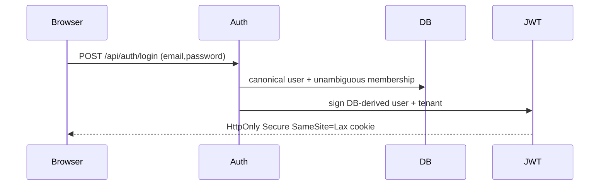
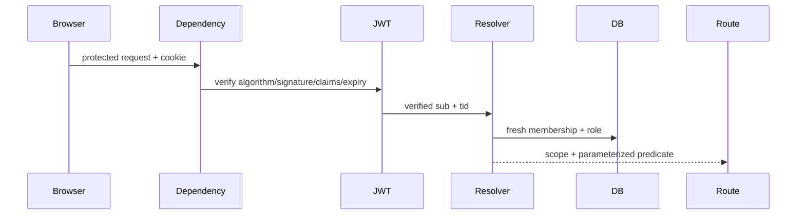

# Design: MVP Authz Foundation

## Technical Approach

Add a FastAPI vertical slice to the ADR-0001 modular monolith: async SQLAlchemy identity persistence, cookie JWT authentication, one fresh authorization resolver, and tenant-bound org administration. It implements the change specs; ADR-0002 governs server-derived scopes, and ADR-0003 will compose them into retrieval.

## Architecture Decisions

| Concern | Choice | Alternatives / rationale |
|---|---|---|
| Modules (proposal; ADR-0001/0002) | `identity` owns models/bootstrap; `auth` passwords/JWT; `authorization` capabilities/scopes; `org` admin HTTP; `db`, `config`, `errors` infrastructure. | Route-local checks or generic service layers widen the security surface; one deep resolver is reviewable. |
| Persistence (tenant-identity) | PostgreSQL UUID models; Alembic async migration; `roles.capabilities` as constrained `text[]`; one role per user/tenant membership. | A grant table is premature before documents; JSONB weakens constraints. |
| Passwords (jwt-authentication) | `argon2-cffi` Argon2id defaults, with rehash after successful verification when parameters change. | Prefer direct, vetted memory-hard hashing over bcrypt or an extra wrapper. |
| JWT (jwt-authentication; DESIGN) | PyJWT HS256 with fixed algorithm and required `sub`, `tid`, `iss`, `aud`, `iat`, `exp`, `jti`; 15-minute expiry. | Roles/capabilities stay out so permission changes apply immediately; same-domain cookie follows DESIGN. |
| Scope (authorization-rbac; ADR-0002/0003) | `AuthorizationScope(tenant_id,user_id,capabilities)` emits SQLAlchemy expressions/binds, never SQL strings; missing capability yields false. | Reject post-filtering and RLS-only enforcement; future retrieval composes this predicate before generation. |

## Data and Runtime Contracts

`tenants(id,name,created_at)`; globally unique canonical `users(email,password_hash)`; tenant-unique `roles(name,capabilities)`; `memberships(tenant_id,user_id,role_id)` with composite role FK and unique user/tenant. Composite indexes lead with `tenant_id`; constraints, not pre-checks, enforce races. Capabilities: `org.settings.manage`, `users.manage`, `documents.manage`, `corpus.view`, `chat.use`; admin gets all, member the last two.

Cookie: `raguard_session`, path `/api`; production requires `Secure`; unsafe requests reject foreign `Origin`. No route accepts tenant identity from path/body/query/header. Surface: `POST /api/auth/login` plus protected `/api/org` user, role, and membership operations required by the specs. Session clearing is a later/non-MVP concern; no logout route is designed here. Cross-tenant targets return neutral 404. Errors use `{error:{code,message,details?}}`: 400 validation, 401 authentication, 403 capability, 404 hidden/missing resource, 409 conflict, 503 dependency, generic 500 with request id.

### Security Boundary

Identity, tenant, role, capabilities, and SQL predicates come only from verified JWT claims plus current database state. Document-derived content is untrusted data and can never influence or execute authorization decisions. This auth-only change accepts no document input; adversarial-document RED tests remain release gates for ingestion, retrieval, and chat slices, where that boundary first exists.

## File Changes

| Path | Action | Purpose |
|---|---|---|
| `apps/api/src/raguard_api/{identity,auth,authorization,org}/`, `{db,config,errors,main}.py`; `apps/api/alembic/`; tests | Create | Modules, migration, strict-TDD suites |
| `apps/api/pyproject.toml`, `uv.lock`, `.env.example` | Modify | Package/CLI, Argon2/Alembic, settings |
| `.github/workflows/ci.yml` | Modify | PostgreSQL 17 service and Python integration gate |
| `infra/compose.yaml` | Unchanged | Existing PostgreSQL is sufficient; fixtures create disposable migrated databases, so no reset helper is needed. |
| `.github/workflows/pr-check.yml` | Unchanged | Existing 400-line gate already enforces chained delivery. |

## Testing and Operations

Strict TDD: RED unit tests for hashing, JWT claims, capabilities, predicates, and errors; RED PostgreSQL integration tests for migration up/down, constraints, bootstrap concurrency/idempotency, cookie/Origin handling, fresh role changes, route-wide resolver use, and cross-tenant/cross-role denial. Then GREEN/refactor. Gate: `uv run pytest -m 'not e2e' && pnpm test`.

`raguard-bootstrap` reads bootstrap secrets from environment, validates before writes, and under a transaction advisory lock either creates tenant/default roles/admin atomically or exits 0 without altering existing identity data. Structured request/auth/bootstrap events exclude passwords, hashes, JWTs, emails, and existence hints; metrics count low-cardinality login/authz outcomes. DB failures become 503; auth failures are not retried.

## Threat Matrix

Routing exists, but no shell, subprocess, VCS, PR automation, or executable classification is introduced.

| Boundary | Applicability | Design / RED test |
|---|---|---|
| Documentation-like paths | N/A — no path classification/execution | None |
| Git repository selection | N/A — no Git operation | None |
| Commit state | N/A — no commit operation | None |
| Push state | N/A — no push operation | None |
| PR commands | N/A — workflows are not automated by product code | None |

## Migration, Rollback, and Delivery

Deploy migration before API; rollback API, then downgrade. Greenfield tables have no dependents; no backfill or feature flag. Forecast: 1,100–1,500 authored lines, high 400-line risk. Auto-chain four independently green 250–400-line PRs: database; auth/login/errors; resolver/org routes; bootstrap/security integration/CI. Each remains within the 800-line session budget.

## Open Questions

None blocking. Per-document grants, RLS backstop, exact rate limits, invite-by-email, chat retention, document deletion, chunking/RRF, evaluation location, and embedding provider remain deferred to their owning changes.
